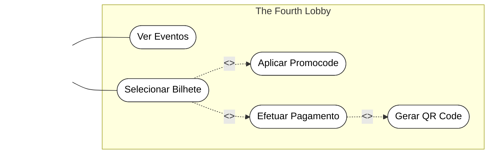
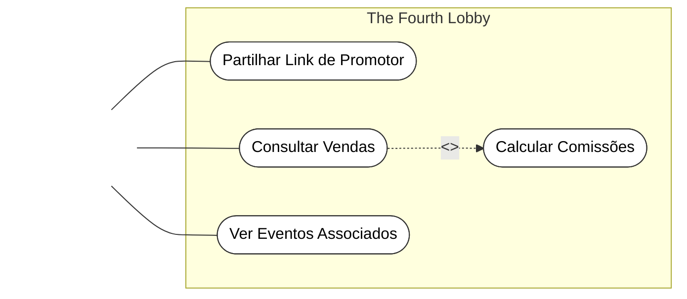
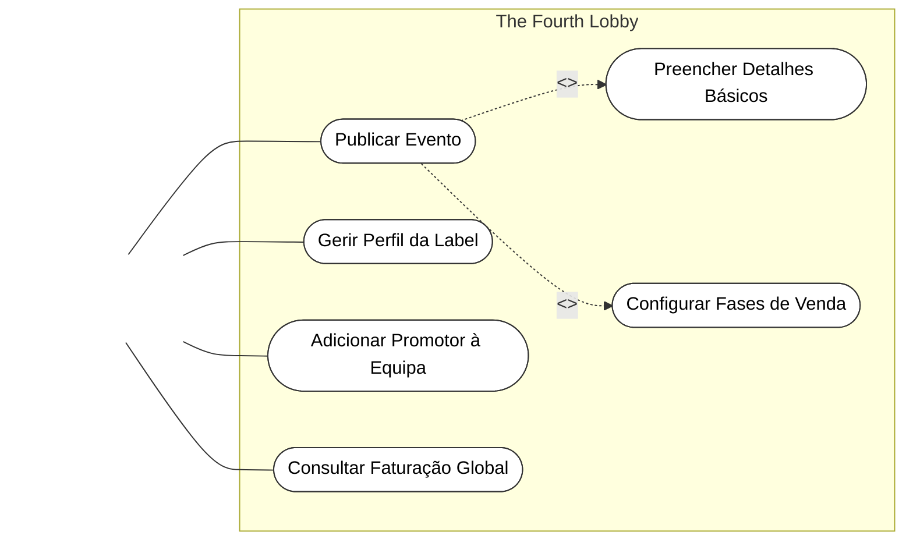

# Diagramas de Casos de Uso (UML Clássico) 📊

Este documento reúne a modelação UML de Casos de Uso da plataforma **The Fourth Lobby**, desenhada com a sintaxe Mermaid para replicar a estrutura clássica de diagramas de casos de uso (Atores à esquerda, fronteira do sistema a delimitar os casos de uso em elipses, ligações sólidas e setas tracejadas com \`<<include>>\` e \`<<extend>>\`).

---

## 1. Módulo de Compra de Bilhetes (Cliente)

---

## 2. Módulo de Afiliação (Promotor)

---

## 3. Gestão e Administração (Organizador)

