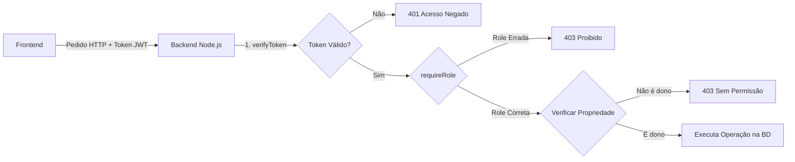

# Documentação: Sistema de Segurança RBAC (Substituto do RLS)

## Contexto: Porquê esta mudança?

Quando usávamos o **Supabase Auth**, a base de dados tinha políticas de **RLS (Row Level Security)** que controlavam quem podia ver o quê. Estas políticas usavam a função `auth.uid()` para identificar o utilizador.

Ao mudar para autenticação manual (Hash + JWT no nosso backend Node.js), **o `auth.uid()` deixou de funcionar** porque o Supabase já não sabe quem é o utilizador — quem sabe é o nosso backend.

A solução foi mover a lógica de segurança para o backend, usando um modelo chamado **RBAC (Role-Based Access Control)**.

---

## Como funciona a segurança agora



A segurança é garantida por **3 camadas**, aplicadas em sequência:

### Camada 1: `verifyToken` (Quem és tu?)
Verifica se o pedido inclui um token JWT válido no header `Authorization`.
- Sem token → **401 Acesso Negado**
- Token inválido/expirado → **401 Token Inválido**
- Token válido → Extrai `{ id, email, role }` e guarda em `req.user`

### Camada 2: `requireRole` (Que cargo tens?)
Verifica se o `role` do utilizador corresponde ao necessário.
- Cliente a tentar criar evento → **403 Permissões Insuficientes**
- Organizador a criar evento → ✅ Passa

### Camada 3: Verificação de Propriedade (É teu?)
Mesmo sendo organizador, só podes editar/ver dados dos **teus** eventos.
- Organizador A a tentar editar evento do Organizador B → **403 Sem Permissão**
- Organizador A a editar o seu próprio evento → ✅ Executa

---

## Mapa Completo de Rotas

### Autenticação ([auth.js](file:///c:/Users/rodri/OneDrive/Documentos/INFOWEB/Projeto%20Final%20De%20Curso/the-fourth-lobby/backend/routes/auth.js))

| Método | Endpoint | Proteção | Descrição |
|--------|----------|----------|-----------|
| POST | `/api/auth/register` | Nenhuma | Registar novo utilizador |
| POST | `/api/auth/login` | Nenhuma | Login (recebe JWT) |
| GET | `/api/auth/me` | `verifyToken` | Ver dados do utilizador logado |

---

### Eventos ([events.js](file:///c:/Users/rodri/OneDrive/Documentos/INFOWEB/Projeto%20Final%20De%20Curso/the-fourth-lobby/backend/routes/events.js))

| Método | Endpoint | Proteção | Quem pode? |
|--------|----------|----------|------------|
| GET | `/api/events` | Nenhuma | Qualquer pessoa (só publicados) |
| GET | `/api/events/:id` | Nenhuma* | Qualquer pessoa (publicados) / Dono (rascunhos) |
| GET | `/api/events/my/events` | `verifyToken` + `requireRole('organizer')` | O organizador vê os seus eventos |
| POST | `/api/events` | `verifyToken` + `requireRole('organizer')` | Organizer cria evento |
| PUT | `/api/events/:id` | `verifyToken` + `requireRole('organizer')` + Propriedade | Dono edita o seu evento |
| DELETE | `/api/events/:id` | `verifyToken` + `requireRole('organizer')` + Propriedade | Dono apaga o seu evento |

---

### Bilhetes ([tickets.js](file:///c:/Users/rodri/OneDrive/Documentos/INFOWEB/Projeto%20Final%20De%20Curso/the-fourth-lobby/backend/routes/tickets.js))

| Método | Endpoint | Proteção | Quem pode? |
|--------|----------|----------|------------|
| GET | `/api/tickets/my` | `verifyToken` | O utilizador vê os SEUS bilhetes |
| GET | `/api/tickets/event/:id` | `verifyToken` + `requireRole('organizer')` + Propriedade | Organizador vê bilhetes do SEU evento |

> [!IMPORTANT]
> **Equivalente RLS antigo:** `using (auth.uid() = user_id)` → Agora é `.eq('user_id', req.user.id)` no backend.

---

### Despesas ([expenses.js](file:///c:/Users/rodri/OneDrive/Documentos/INFOWEB/Projeto%20Final%20De%20Curso/the-fourth-lobby/backend/routes/expenses.js))

| Método | Endpoint | Proteção | Quem pode? |
|--------|----------|----------|------------|
| GET | `/api/expenses/event/:id` | `verifyToken` + `requireRole('organizer')` + Propriedade | Organizador vê despesas do SEU evento |
| POST | `/api/expenses/event/:id` | `verifyToken` + `requireRole('organizer')` + Propriedade | Organizador adiciona despesa |
| DELETE | `/api/expenses/:id` | `verifyToken` + `requireRole('organizer')` + Propriedade | Organizador apaga despesa |

> [!IMPORTANT]
> O ficheiro `expenses.js` reutiliza uma função `verifyEventOwnership()` para evitar repetição de código — é um bom ponto para mencionar na defesa do projeto.

---

## Estrutura Final do Backend

```
backend/
├── .env                    ← Chaves secretas (JWT_SECRET, SUPABASE_SERVICE_ROLE_KEY)
├── server.js               ← Ponto de entrada Express
├── lib/
│   └── supabase.js         ← Cliente Supabase centralizado (service_role)
├── middleware/
│   └── auth.js             ← verifyToken + requireRole
└── routes/
    ├── auth.js             ← Registo, Login, /me
    ├── events.js           ← CRUD de eventos
    ├── tickets.js          ← Consulta de bilhetes
    └── expenses.js         ← Gestão de despesas
```

## Comparação: RLS vs RBAC Manual

| Aspeto | RLS (Supabase) | RBAC Manual (Backend) |
|--------|----------------|----------------------|
| Onde vive a lógica | Na BD (PostgreSQL) | No código (Node.js) |
| Como identifica o user | `auth.uid()` | Token JWT decodificado |
| Linguagem | SQL | JavaScript |
| Flexibilidade | Limitada a SQL | Total (lógica complexa) |
| Testável no Postman | Não | ✅ Sim |
